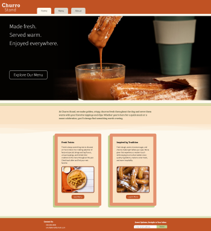

# Restaurant page
---
A simple website for a fictional restaurant. The purpose of this project was to generate the contents of a website with multiple pages using JavaScript and Webpack. As with similar projects, this was additionally used as a study in UI/UX practices and CSS techniques, especially in the context of minimal HTML.

Part of the JavaScript course of The Odin Project curriculum.

---
## Design
The website is themed around a fictional churro restaurant that can be described as rustic with a modern twist. A earthy, neutral color palette is used in pages that are designed similarly to a restaurant menu.  

## JS, Webpack, and Minimal HTML
The base index.html page contains the nav, main, and footer elements. The core section, main, displays content based on the outcome of imported functions. Each page has a .js file that erases the current content before new content is generated and appended to main accordingly.
Parts of a page, such as the contact section of the About page, are created in separate functions. These new elements are then appended to section and main elements accordingly. This assembly process is bundled in a master function, such as buildHome().
### Info Objects and Arrays
Text content, such as menu items and certain informational paragraphs, is placed at the beginning of the file as an object or array.split(" / ") string to allow for easier modification. For example, "Line 1 / Line 2 / Line 3" can be used to create an iterable array of three items that can be used to create three p elements. Menu items are stored in an object containing important information: name, description, alt text, and img srcset urls. Images on all pages have variations to accommodate different device sizes.
### srcset-images.js
srcset-images.js is a master file for image imports from where all responsive versions of each image is exported, to be used by the srcset values generated within the builder functions in each .js file.  

## Notes
With the increased complexity of this project over a static web page, the value of optimizing many files with Webpack becomes clear. Likewise, one of the prevalent challenges of using primarily JavaScript to create page content was establishing consistency. Some builder functions currently append to sections, while some append directly to main#content and await a combiner function. Using the same format, or even a class (tested in Contact section on About page), could add some control to the cascading logic of the functions and make the building process cleaner. Consistency in CSS was also particularly challenging, undoubtedly compounded by the variations in the JS functions.   
Modularizing parts of each page, especially the many images and srcset URLs, greatly helped with making quick changes. Conversely, structural changes within sections, such as making containers for internal elements, became more difficult. This was in large part due to the changes required in both JS functions and CSS. Such issues could be alleviated with more preplanning, more consistent organization and naming scheme.  

Other improvements that the existing structure of the site supports:
-- An order page / flyout menu
-- A much more detailed Specials section on the Menu page with pictures for each rotating flavor
-- A detailed directions page with an embedded map
-- A newsletter section in the About page
-- Accents and other design elements to complement the menu-like theme of the page

    